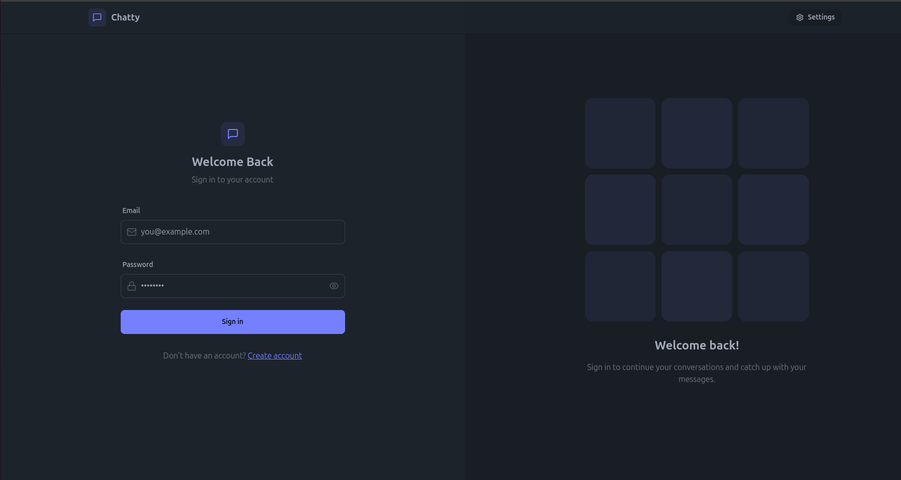
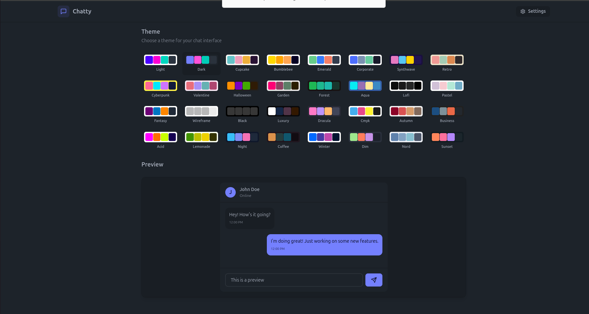
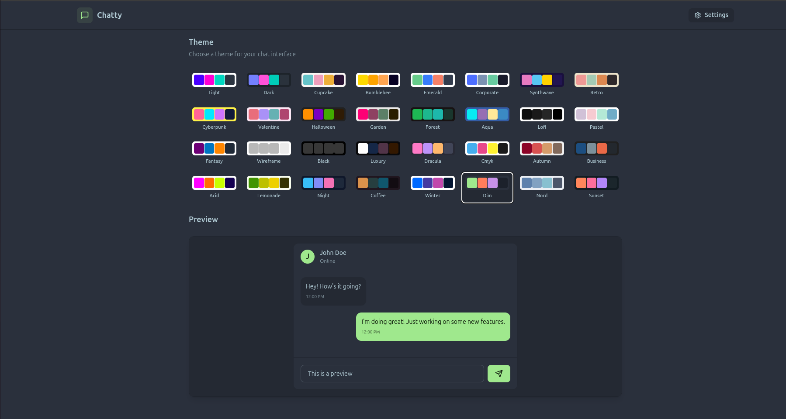
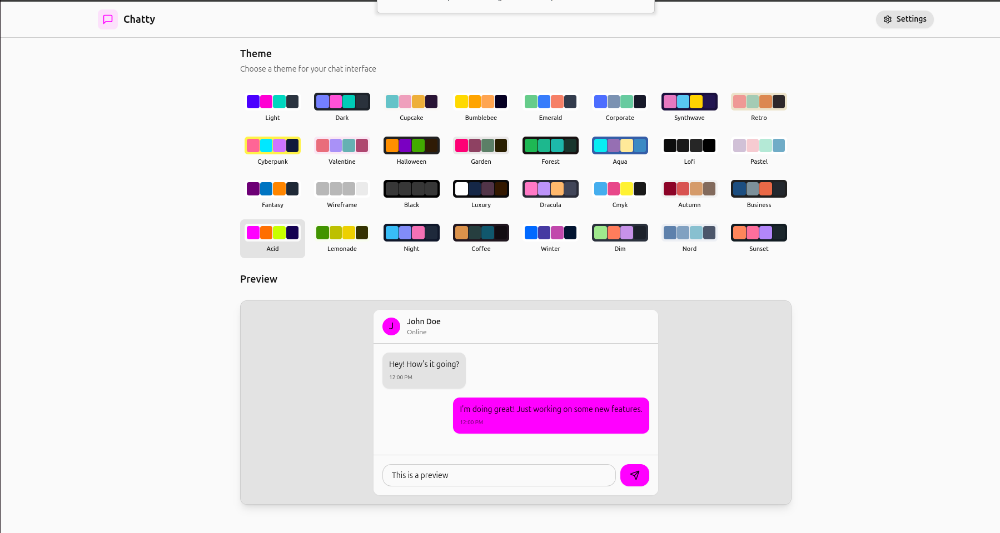
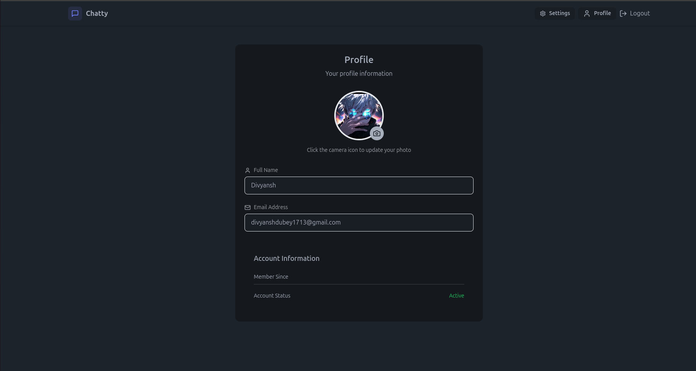
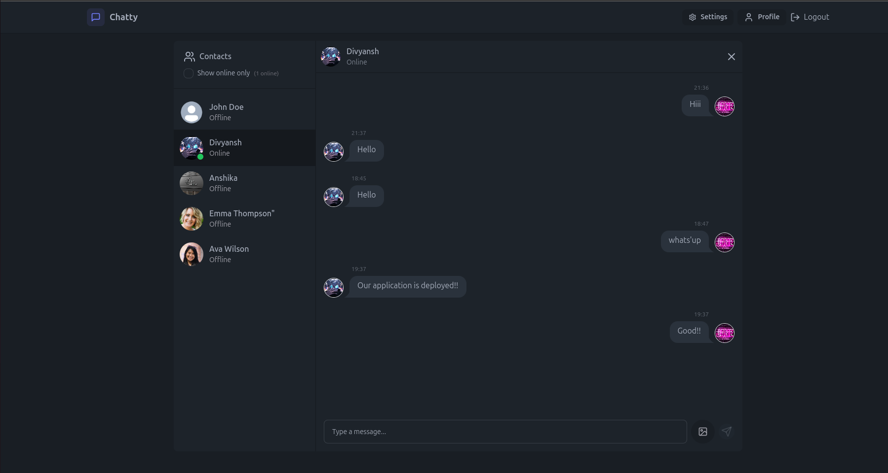
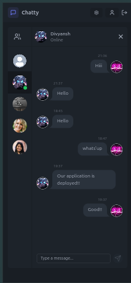

# Full Stack Chat application
This is a full-stack chat application that enables seamless real-time messaging, allowing users to connect and communicate effortlessly. It features a fully responsive and customizable interface designed for an engaging and user-friendly experience.

## 🚀 Live Application
https://chatapplication-4fu2.onrender.com

<div style="display: flex; align-items: center; justify-content: space-evenly; flex-wrap: wrap; gap: 1rem">
    
    
    
    
    
    
    
</div>

## 🎯 Features
-- **Real-time Messaging Using Socket.io:** Enables seamless and instant communication between users with real-time updates.

-- **Fully Responsive Design:** Optimized for both desktop and mobile devices, ensuring a smooth user experience across all screen sizes.

-- **User Authentication Using JWT:** Secure authentication and authorization implemented with JSON Web Tokens (JWT) for protected access.

-- **32 Themes Integrated with Daisy UI:** Provides a highly customizable user interface with 32 themes, enhancing the chat experience with various styles.

-- **User-Centric Interface:** Designed with a clean and intuitive UI, focusing on accessibility and ease of use for all users

## 🛠️ Tech Stack
- **Frontend:** React.js, HTML5, CSS3, Tailwind CSS
- **Backend:** Node.js, Express.js,
- **Database:** MongoDB Atlas
- **APIs:** RESTful API design, Cloudinary,
- **Socket.io**
- **Hosting:** Render


## 📂 Project Structure
The project is divided into two main parts: frontend and backend.

## ⚙️ Setup and Installation
Clone the repository 
```bash
git clone https://github.com/divyansh1705/ChatApplication.git
```
### Client Setup
1. Install dependencies:
```bash
cd frontend
npm install
```

3. Start the development server:
```bash
npm run dev
```

### Server Setup
1. Install dependencies:
```bash
cd backend
npm install
```

2. Set up environment variables as shown in .env.example
```

3. Start the backend server:
```bash
npm run dev
```

## 📝 Contribution Guidelines
To contribute:
1. Fork the repository.
2. Create a new branch for your feature/bug fix.
3. Commit your changes with meaningful commit messages.
4. Push to your fork and submit a pull request.

## 📬 Contact
For any issues or suggestions, contact me at divyanshd@iitbhilai.ac.in